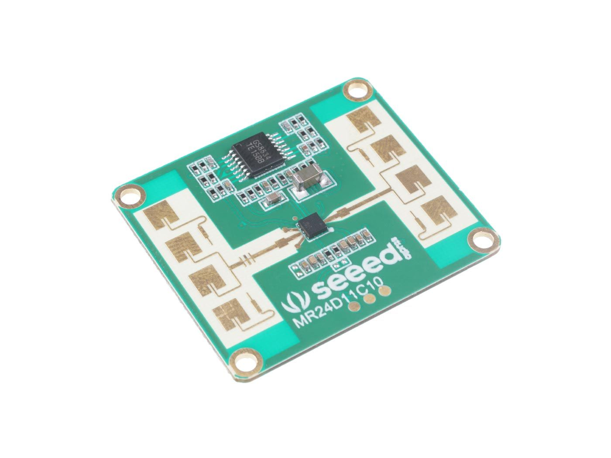

# MR24FDB1 (Seeed 24 GHz Fall & Presence Radar) — ESPHome external component

Zewnętrzny komponent **ESPHome** dla radaru **Seeed Studio MR24FDB1** (UART), który udostępnia:
- `presence` (binarny, do automatyzacji świateł),
- `environment_triplet` (surowe bajty 00 FF FF / 01 00 FF / 01 01 01),
- `environment_label` (Unoccupied / Someone stationary / Someone moving / Occupied (other)),
- `approach_state` (None / Close / Away),
- `fall_state` (None / Suspected / Real),
- `fall_detected` (binarny),
- `sign_parameter` (aktywny „body sign”, 0–100).

> Dlaczego **external_components**? To oficjalny sposób na rozszerzenia w ESPHome (następca legacy „custom component”). Dzięki temu komponent działa stabilnie w nowych wersjach ESPHome. :contentReference[oaicite:1]{index=1}

## ✨ Funkcje i mapowania (wg dokumentacji Seeed)

**Environment status** (`func=0x04/0x03`, `a1=0x03`, `a2=0x05`, `DATA[0..2]`):
- `00 FF FF` → **Unoccupied**
- `01 00 FF` → **Someone stationary**
- `01 01 01` → **Someone moving** :contentReference[oaicite:2]{index=2}

**Approach / Away** (`func=0x04/0x03`, `a1=0x03`, `a2=0x07`, `DATA[0]`):
- `0x01` None, `0x02` Close, `0x03` Away. :contentReference[oaicite:3]{index=3}

**Sign parameter** (`func=0x04/0x03`, `a1=0x06`): zwykle 4-bajtowy float (LE) lub 1 bajt 0..100.
- 0 = brak osoby, 1 = osoba statyczna, 2..100 = aktywność. :contentReference[oaicite:4]{index=4}

**Fall reporting** (część firmware): `func=0x06`, `a1=0x01`, `DATA[0]`:
- `0x00` Suspected, `0x01` Real, `0x02` None. :contentReference[oaicite:5]{index=5}

## 🔧 Wymagania

- ESP32 (testowane na **NodeMCU-32S**) z UART na pinach `RX=GPIO16`, `TX=GPIO17`
- **ESPHome 2024.8+** (sprawdzone także na 2025.10.x)
- Połączenie UART z MR24FDB1 @ `9600 8N1` :contentReference[oaicite:6]{index=6}

## 📦 Instalacja

### A) Lokalnie (zalecane podczas rozwoju)

Skopiuj folder `components/` do katalogu projektu ESPHome (obok pliku `your_node.yaml`), zachowując strukturę:

